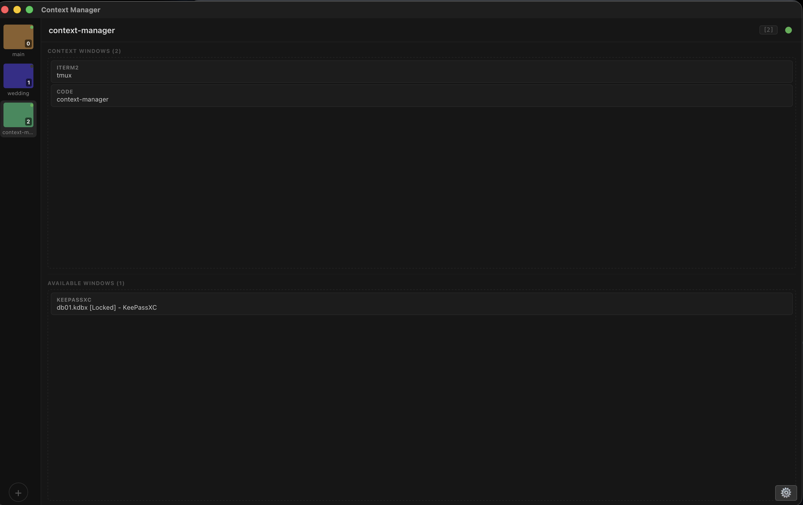
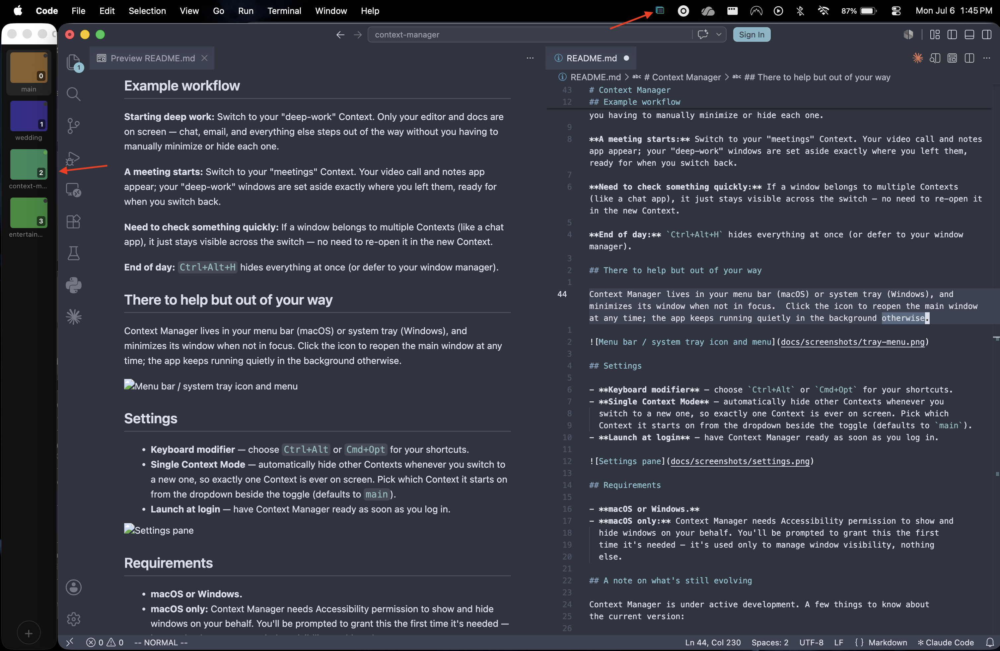
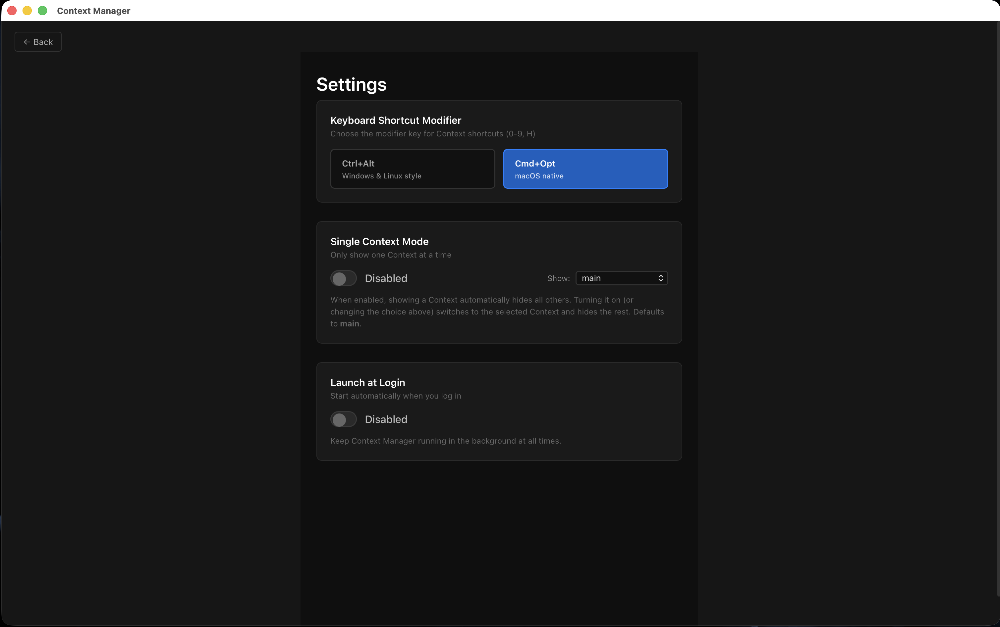

# Context Manager

A desktop app for Windows and macOS that keeps you focused on what you're working on right now — and nothing else.

## The problem with virtual desktops

macOS Spaces and Windows virtual desktops group windows, but they force a constraint that doesn't match my workflow: **every window lives on exactly one desktop.** If you're like me, Slack/Teams, Outlook, and my terminal often belong to several projects at once, so the 1:1 window:workspace model just doesn't work, and I end up minimizing or hiding windows manually to reduce visual clutter that my window manager can't solve for me.

## How Context Manager is different

Context Manager groups windows into named **Contexts** — but unlike a virtual desktop, a single window can belong to as many Contexts as you want.

- Put your chat, email, terminal, and notes apps in every Context, alongside whatever project-specific windows you're using.
- Hiding or switching to a Context is just a keyboard shortcut away — no swiping through desktops, waiting for slow animations, or hunting through a taskbar or Mission Control.
- Switch back to a Context and your windows are back, exactly where you left them.
- Turn on **Single Context Mode**, and switching to a new Context automatically clears whatever was on screen before — you're always looking at one focused set of windows.

You decide what belongs on screen for the task at hand, and
switching tasks is a single keystroke instead of a manual chore.

## Requirements

- **macOS or Windows.**
- **macOS only:** Context Manager needs Accessibility permission to show and
  hide windows on your behalf. You'll be prompted to grant this the first
  time it's needed — it's used only to manage window visibility, nothing
  else.

## Getting started

1. **Create a Context** for each area of focus — e.g. "deep-work," "meetings," "project-x." Context Manager starts you off with a **main** context that automatically collects every window you open, so you always have a catch-all.
2. **Add windows to a Context** by dragging them from the "Available Windows" list into the Context. By default this *moves* the window out of the catch-all `main` context. Hold **Shift** while you drop to *copy* it instead — the window stays in `main` (and any other Context it's in), so it remains available to add to more Contexts. That's how a single window can live in several Contexts at once.
3. **Assign a keyboard shortcut** (0–9) to your most-used Contexts from the sidebar's right-click menu.
4. **Switch instantly** with `Ctrl+Alt+<number>` (or `Cmd+Opt+<number>` on macOS, if you prefer that style — configurable in Settings). Hit `Ctrl+Alt+H` any time to clear your screen entirely.

## Example workflow

**Starting deep work:** Switch to your "deep-work" Context. Only your editor and docs are on screen — chat, email, and everything else steps out of the way without you having to manually minimize or hide each one.

**A meeting starts:** Switch to your "meetings" Context. Your video call and notes app appear; your "deep-work" windows are set aside exactly where you left them, ready for when you switch back.

**Need to check something quickly:** If a window belongs to multiple Contexts (like a chat app), it just stays visible across the switch — no need to re-open it in the new Context.

**End of day:** `Ctrl+Alt+H` hides everything at once (or defer to your window manager).

## There to help but out of your way

Context Manager lives in your menu bar (macOS) or system tray (Windows), and minimizes its window when not in focus.  Click the icon to reopen the main window at any time; the app keeps running quietly in the background otherwise.

## Settings

- **Keyboard modifier** — choose `Ctrl+Alt` or `Cmd+Opt` for your shortcuts.
- **Single Context Mode** — automatically hide other Contexts whenever you
  switch to a new one, so exactly one Context is ever on screen. Pick which
  Context it starts on from the dropdown beside the toggle (defaults to `main`).
- **Launch at login** — have Context Manager ready as soon as you log in.

## A note on what's still evolving

Context Manager is under active development. A few things to know about
the current version:

* Tests - they're coming, I promise.
* Window groupings are remembered only while the app that owns them keeps
  running — if you quit an app, its windows drop out of your Contexts.
* On macOS, hiding a window currently uses the system minimize animation,
  so you'll see the standard "genie" effect and a Dock thumbnail rather than
  an instant disappearance. I'm researching a fully instant, animation-free option that doesn't rely on fragile, private APIs.
* See [BACKLOG.md](BACKLOG.md) for planned improvements, including quick Context
  toggles from the tray menu.

## Contributing/Suggestions

Contributions and suggestions are welcome! To make a feature request, report a bug, or otherwise comment on existing functionality, please file an issue.
For contributions please submit a PR, but make sure to lint, type-check, and test your code before doing so. Thanks in advance!